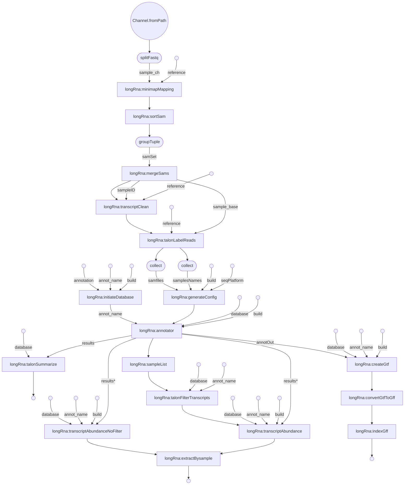

# 
Long Read RNA-Seq transcript annotation Workflow

Nextflow workflow for long read RNA-seq analysis using minimap2 and talon. 

***
Nextflow workflow
***  

```mermaid
flowchart TD
    p0((Channel.fromPath))
    p1([splitFastq])
    p2(( ))
    p3[longRna:minimapMapping]
    p4[longRna:sortSam]
    p5([groupTuple])
    p6[longRna:mergeSams]
    p8(( ))
    p9[longRna:transcriptClean]
    p10(( ))
    p11(( ))
    p12(( ))
    p13[longRna:initiateDatabase]
    p15(( ))
    p16[longRna:talonLabelReads]
    p17([collect])
    p18([collect])
    p19(( ))
    p20(( ))
    p21[longRna:generateConfig]
    p23(( ))
    p24(( ))
    p25[longRna:annotator]
    p27[longRna:sampleList]
    p28(( ))
    p29[longRna:talonSummarize]
    p30(( ))
    p31(( ))
    p32(( ))
    p33[longRna:talonFilterTranscripts]
    p34(( ))
    p35(( ))
    p36(( ))
    p37[longRna:transcriptAbundanceNoFilter]
    p38(( ))
    p39(( ))
    p40(( ))
    p41[longRna:transcriptAbundance]
    p42(( ))
    p43(( ))
    p44(( ))
    p45[longRna:createGtf]
    p46[longRna:extractBysample]
    p47(( ))
    p48[longRna:convertGtfToGff]
    p49[longRna:indexGff]
    p50(( ))
    p0 --> p1
    p1 -->|sample_ch| p3
    p2 -->|reference| p3
    p3 --> p4
    p4 --> p5
    p5 -->|samSet| p6
    p6 --> p9
    p6 -->|sampleID| p9
    p8 -->|reference| p9
    p9 --> p16
    p10 -->|annotation| p13
    p11 -->|annot_name| p13
    p12 -->|build| p13
    p13 -->|annot_name| p25
    p15 -->|reference| p16
    p6 -->|sample_base| p16
    p16 --> p17
    p16 --> p18
    p17 -->|samfiles| p21
    p18 -->|samplesNames| p21
    p19 -->|build| p21
    p20 -->|seqPlatform| p21
    p21 --> p25
    p23 -->|database| p25
    p24 -->|build| p25
    p25 --> p27
    p27 --> p33
    p28 -->|database| p29
    p25 -->|results| p29
    p29 --> p30
    p31 -->|database| p33
    p32 -->|annot_name| p33
    p33 --> p41
    p34 -->|database| p37
    p35 -->|annot_name| p37
    p36 -->|build| p37
    p25 -->|results*| p37
    p37 --> p46
    p38 -->|database| p41
    p39 -->|annot_name| p41
    p40 -->|build| p41
    p25 -->|results*| p41
    p41 --> p46
    p25 -->|annotOut| p45
    p42 -->|database| p45
    p43 -->|annot_name| p45
    p44 -->|build| p45
    p45 --> p48
    p46 --> p47
    p48 --> p49
    p49 --> p50
```